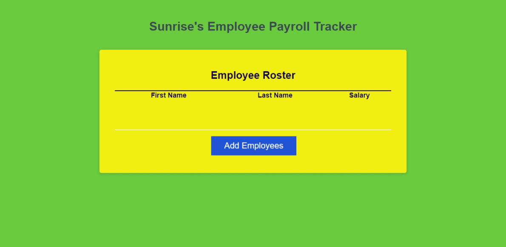

# EmployeeRoster
JavaScript code to enter employee's first and last name. The user can add the employee's salary. The information should sorted alphabetcially by employee's last name. 

https://github.com/RoxD90/EmployeeRoster

file:///C:/Users/RoxK3/OneDrive/Desktop/edx%202024/UNCC-VIRT-FSF-PT-01-2024-U-LOLC/03-JavaScript/02-Challenge/EmployeeRoster/index.html

